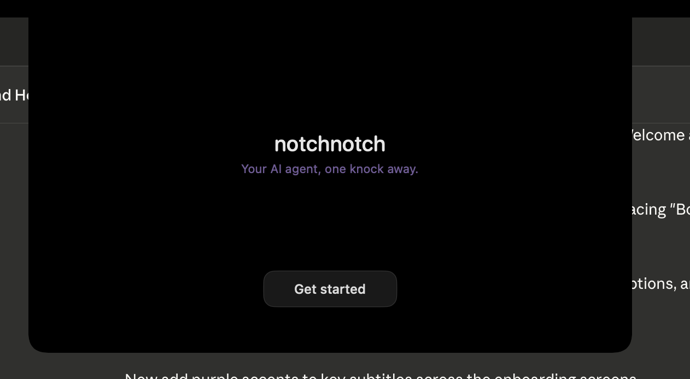
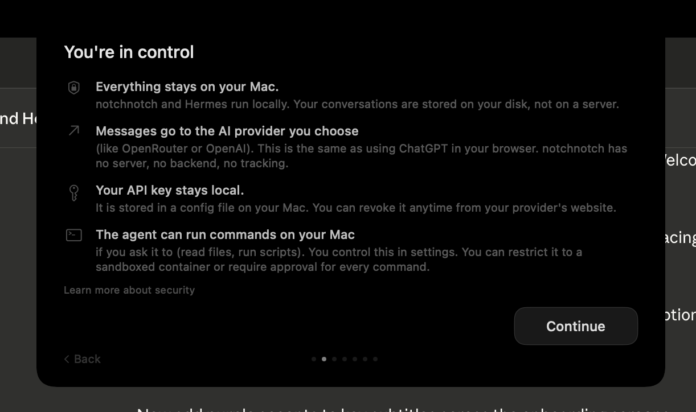
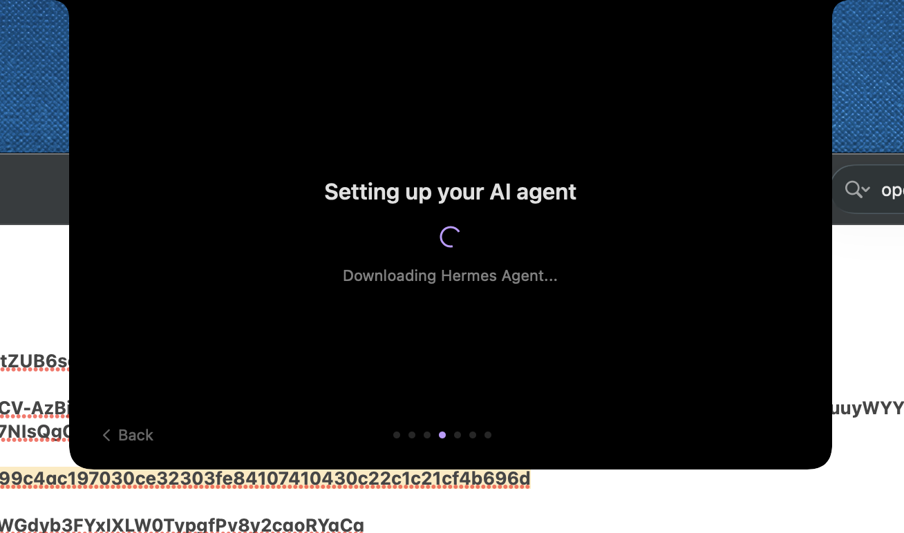

# NotchNotch

Your MacBook already has an AI agent. It just doesn't know it yet.

[Hermes](https://github.com/NousResearch/hermes-agent) is an open-source AI agent that reads your files, runs scripts, browses the web, manages your calendar, and handles the tedious stuff on your behalf. It's powerful, but today it lives in a terminal. You have to open a new window, type commands, copy-paste context back and forth. That works if you're a developer. It doesn't work for everyone else.

notchnotch fixes that. It puts Hermes inside your MacBook's notch. Hover, talk, done. No window to open, no app to switch to, no context lost. Your agent is just there, always, in a space that was doing nothing until now.

It also gives your agent a brain you can feed. Drop a file on the notch, paste an image, record a voice memo, clip a web page from Chrome. Everything lands in Hermes's memory and wiki, and your agent gets smarter over time. Set up routines so it works while you sleep. Pick up the same conversation on Telegram from your phone. One agent, everywhere.

No terminal. No API keys to find. No config files. notchnotch installs Hermes for you on first launch, picks a free model, and you're talking to your computer in under two minutes.


<p align="center">
  <picture>
    <source media="(prefers-color-scheme: dark)" srcset="docs/logo-white.png">
    <source media="(prefers-color-scheme: light)" srcset="docs/logo-black.png">
    
  </picture>
</p>

<p align="center">
  
  
  
</p>

Built with Swift & SwiftUI. Inspired by [BoringNotch](https://github.com/TheBoredTeam/boring.notch) and [NotchNook](https://lo.cafe/notchnook).

---

## Features

### Chat in the notch
Hover or click the notch to expand a chat panel. Your agent remembers context across app restarts via server-side conversation persistence. Edit any message you sent, edit any answer, copy, or retry for a fresh response.

### Routines
Create and monitor automated tasks from a visual panel. 25 ready-made templates across 7 categories (Personal, Professional, Research, Travel, Health, Finance, Creator), or describe your own in plain English. Active jobs display as cards with live status, human-readable schedule, run count, and next execution time. Pause, reschedule, or remove with a right-click.

### Brain
Three-tab panel to browse everything your agent knows:
- **Memory** -- facts, project context, and preferences parsed from Hermes's memory files.
- **Skills** -- installed agent skills with category badges and descriptions.
- **Wiki** -- Karpathy-style knowledge base. Articles your agent has written or that you've fed it. "Ask" button on each article to query Hermes directly.

### Brain dumps
Multiple ways to feed your agent's brain:
- **Voice memo** -- `Ctrl+Shift+R` from anywhere, transcribed locally and sent as text.
- **Drag and drop** -- drop any file onto the notch. Images, PDFs, code (35+ languages), CSV, JSON, YAML.
- **Paste images** -- `Cmd+V` an image from clipboard, attached to the message.
- **[NotchNotch Clipper](https://github.com/KikinaStudio/NotchNotch-Clipper)** -- Chrome extension that clips any web page straight into your agent's brain.

### Conversation history
Browse and resume past sessions. Color-coded source icons (orange=CLI, blue=Telegram, purple=Discord). Tap to resume with full context. New conversation button always accessible from the notch.

### Telegram continuity
notchnotch auto-detects your Telegram session. Same conversation on your Mac and your phone, no manual linking. One agent, two interfaces.

### Expanded bar
When the notch is open, a bar shows model name, reasoning effort selector (none to xhigh), context window gauge, and incognito mode toggle.

### Inline images and smart file paths
Images in responses render as inline thumbnails. File paths render as color-coded cards. Click to open, right-click to reveal in Finder.

### Voice memos
`Ctrl+Shift+R` from any app. KITT-style purple scanner line under the notch. Transcribed on-device (macOS Speech). Mic button in the input bar does the same.

### Collapsible thinking and tool calls
Hermes's internal reasoning and tool execution are hidden behind toggles. You see the clean answer. Expand if you're curious.

### Search
Full-text search across all messages. Match counter, navigation, auto-scroll, purple highlights.

### Code blocks and markdown
Fenced code with language labels, bold, italic, inline code, links.

### Toast notifications
When the notch is closed, a black toast slides under the notch with the response preview. Tap to expand.

---

## Getting started

### 1. Install

**Homebrew (recommended):**

```bash
brew install --cask KikinaStudio/tap/notchnotch --no-quarantine
```

**Or download the DMG** from [GitHub Releases](https://github.com/KikinaStudio/Notchnotch/releases). Drag to Applications, then run once:

```bash
xattr -cr /Applications/notchnotch.app
```

This clears the macOS quarantine flag (the app is not signed with an Apple Developer certificate yet). If macOS still blocks the app, see [docs/GATEKEEPER_FIRST_LAUNCH.md](docs/GATEKEEPER_FIRST_LAUNCH.md) for the right-click and System Settings workarounds — the same guide applies after every Sparkle auto-update.

**Updates from 1.2.1 onwards:** notchnotch self-updates via Sparkle. When a new release is out, the app shows a prompt with release notes — click **Install and Relaunch**. Each new version re-triggers macOS's Gatekeeper warning (we're still ad-hoc-signed); the app shows a one-click guide right after the relaunch. See [docs/GATEKEEPER_FIRST_LAUNCH.md](docs/GATEKEEPER_FIRST_LAUNCH.md).

**Or build from source:**

```bash
git clone https://github.com/KikinaStudio/Notchnotch.git
cd NotchNotch
bash scripts/run.sh
```

No Xcode required. Command Line Tools only (`xcode-select --install`).

### 2. First launch

notchnotch handles everything on first open:

1. **Welcome** -- the notchnotch logo
2. **Privacy** -- what stays local, what goes to your AI provider
3. **Install** -- Hermes installs automatically in the background
4. **Model** -- pick a free model (Nous Portal, zero config)
5. **Telegram** -- optionally connect a Telegram bot for mobile access
6. **Ready** -- start chatting

If Hermes is already installed (`~/.hermes/config.yaml` exists), the onboarding is skipped.

### 3. Talk to your agent

Hover the notch or click it. Type your question, press Return. That's it.

A few things to try first:
- Ask it to summarize a file: drag a PDF onto the notch
- Set up a daily routine: open Routines from the burger menu, pick a template
- Record a voice memo: `Ctrl+Shift+R`, speak, press again to send
- Clip a web page: install [NotchNotch Clipper](https://github.com/KikinaStudio/NotchNotch-Clipper), click the extension on any page
- Check what your agent knows: open the Brain panel, browse Memory, Skills, Wiki
- Continue from your phone: set up Telegram in Settings, same conversation carries over

### 4. Settings

Click the gear icon (top-right):
- **AI Provider** -- switch between Nous, OpenRouter, OpenAI, Anthropic. Paste API keys.
- **Agent** -- max iterations (Quick/Normal/Deep), streaming toggle.
- **Execution** -- terminal backend (local/docker/ssh).
- **Session** -- Telegram session status.

---

## Requirements

- **macOS 14** (Sonoma) or later
- **MacBook with notch** (works on non-notch Macs too, positioned at top-center)

Hermes is installed automatically on first launch. No terminal required.

### Permissions

macOS will prompt for:
- **Microphone** -- voice memos (only when you tap mic)
- **Speech Recognition** -- on-device transcription
- **Accessibility** (manual) -- for the global `Ctrl+Shift+R` hotkey. Add the app in System Settings > Privacy & Security > Accessibility.

---

## Known limitations

- **No local message history on restart** -- the UI starts blank after relaunch, but Hermes preserves full conversation context server-side. Your agent remembers everything.
- **Fixed notch size** -- 580x340pt. Dynamic height and drag-to-resize are planned.
- **Hardcoded localhost:8642** -- no UI to change the Hermes URL yet.
- **Read-only cron management** -- routine actions (pause, schedule change, remove) go through chat. No direct API manipulation from the UI.
- **Unsigned** -- triggers Gatekeeper. Use `xattr -cr` or install via Homebrew with `--no-quarantine`.

---

## Roadmap

- [x] Guided onboarding (zero-terminal install)
- [x] Telegram session continuity
- [x] Conversation history UI
- [x] Routines with template browser
- [x] Brain panel (Memory, Skills, Wiki)
- [x] NotchNotch Clipper extension
- [x] Inline images and paste from clipboard
- [x] Edit messages and answers
- [x] Expanded bar (model, reasoning effort, context gauge, incognito)
- [x] LLM provider picker with brand icons (11 providers, custom OpenAI-compatible endpoints, custom model IDs)
- [x] Memory provider selection UI (built-in, hindsight, mem0, supermemory, honcho, retaindb, openviking, byterover, holographic)
- [ ] Dynamic notch height (auto-grow with content, drag handle)
- [x] Auto-update via Sparkle (EdDSA-signed, ad-hoc release)
- [x] Universal binary (arm64 + x86_64)
- [ ] Apple Developer signing + notarization
- [ ] Telegram Mini App (cron jobs, system monitoring, full mobile UI)

---

## License

MIT

---

## Acknowledgements

- Routines icon: `call-bell` from [Phosphor Icons](https://phosphoricons.com/), licensed under MIT.

---

<details>
<summary><strong>Technical documentation</strong> (for contributors)</summary>

## Architecture

```
notchnotch (NSPanel, always-on-top, level mainMenu+3)
    |
    +-- NotchShape (custom animatable path, quad curves)
    |     Closed: matches hardware notch (~185x32pt)
    |     Open: expanded chat panel (580x340pt)
    |
    +-- Top bar (when open)
    |     Left: search button
    |     Right: settings button
    |
    +-- Content (when open)
    |     Onboarding flow (6 screens, first launch only)
    |     Welcome screen (logo + tagline, before first message)
    |     ChatView: messages + input bar
    |       MessageBubble: thinking/tool toggles, code blocks, file cards
    |       Input bar: [+file] [mic] [...more] [send/spinner]
    |     -- OR --
    |     RoutinesView: job cards + template browser
    |     BrainView: memory cards, skills, wiki
    |     ConversationHistoryView: session browser
    |     SettingsView: agent config + session status
    |
    +-- Overlays
    |     KITT scanner (recording), Braille spinner (thinking)
    |     Drop overlay (file drag), Toast (response preview)
    |
    +-- Services
          HermesClient -> localhost:8642 (/v1/responses, non-streaming)
          SessionStore -> auto-detect Telegram session from state.db
          SpeechTranscriber, DocumentExtractor, AudioRecorder
```

## Project structure

```
BoaNotch/
+-- Package.swift                        # SwiftPM, macOS 14+
+-- scripts/
|   +-- run.sh                           # Build + bundle + codesign + launch
|   +-- release.sh                       # Universal binary + DMG + ad-hoc sign
+-- homebrew/
|   +-- notchnotch.rb                    # Homebrew Cask formula template
+-- BoaNotch/
    +-- BoaNotchApp.swift                # @main entry point
    +-- AppDelegate.swift                # Lifecycle, Carbon hotkeys, menu bar, voice
    +-- AppConstants.swift               # Colors, file icons, cursor modifier
    +-- Info.plist                        # LSUIElement, ATS, mic/speech permissions
    +-- BoaNotch.entitlements            # network.client
    +-- Resources/
    |   +-- AppIcon.icns                 # App icon (all sizes)
    |   +-- menubar-icon.png/@2x.png     # Menu bar template icon
    |   +-- logo-white.png               # Welcome screen logo (white)
    |   +-- icon.svg, logo.svg           # Source SVGs
    |
    +-- Models/
    |   +-- ChatMessage.swift            # role, content, thinking, toolCalls
    |   +-- Attachment.swift             # fileName, fileType, textContent, fileURL
    |   +-- RoutineTemplates.swift       # 25 templates, 7 categories, {{placeholder}} substitution
    |
    +-- ViewModels/
    |   +-- NotchViewModel.swift         # State machine (closed/open/toast)
    |   +-- ChatViewModel.swift          # Messages, send/cancel/retry, voice
    |   +-- SearchViewModel.swift        # Search matches, navigation
    |
    +-- Views/
    |   +-- NotchView.swift              # Root: shape + top bar + overlays
    |   +-- ChatView.swift               # Scroll + welcome screen + input bar
    |   +-- MessageBubble.swift          # Thinking/tool toggles, code, file cards, copy/retry
    |   +-- SearchBarView.swift          # Search input + match counter
    |   +-- RoutinesView.swift            # Job cards + template browser toggle
    |   +-- TemplateBrowserView.swift    # 3-screen drill-down: categories -> templates -> form
    |   +-- ConversationHistoryView.swift # Session browser from state.db
    |   +-- BrainView.swift              # Memory/Skills/Wiki tabs
    |   +-- SettingsView.swift           # Agent config + session status
    |   +-- ExpandedBarView.swift        # Profile, model, reasoning (Menu), incognito
    |   +-- NotchShape.swift, ToastView.swift, DropOverlay.swift
    |
    +-- Window/
    |   +-- NotchPanel.swift             # Borderless NSPanel subclass
    |   +-- NotchWindowController.swift  # Positioning, drag monitor, screen tracking
    |
    +-- Onboarding/
    |   +-- OnboardingViewModel.swift    # Step state, install, config writes
    |   +-- OnboardingContainerView.swift # Step router + nav dots
    |   +-- WelcomeStep.swift            # Screen 1: logo + tagline
    |   +-- PrivacyStep.swift            # Screen 2: privacy explainer
    |   +-- InstallHermesStep.swift       # Screen 3: background installer
    |   +-- ChooseModelStep.swift         # Screen 4: model picker (Nous Portal free models)
    |   +-- TelegramStep.swift            # Screen 5: optional Telegram bot
    |   +-- ReadyStep.swift              # Screen 6: done
    |   +-- OAuthService.swift           # PKCE + OpenRouter token exchange (reserved)
    |   +-- ShellRunner.swift            # Async Process() wrapper
    |
    +-- Services/
        +-- HermesClient.swift           # /v1/responses API client
        +-- SessionStore.swift           # Auto-detect Telegram session from state.db
        +-- CronStore.swift               # jobs.json watcher, CronJob model
        +-- HermesConfig.swift           # config.yaml watcher, provider-aware model list
        +-- ClipperListener.swift        # HTTP listener for NotchNotch Clipper extension
        +-- SpeechTranscriber.swift      # SFSpeechRecognizer, French locale
        +-- DocumentExtractor.swift      # 40+ file types, 50K char limit
        +-- AudioRecorder.swift          # AVAudioRecorder, M4A
```

## How it works

### Response parsing

`HermesClient.parseOutput()` walks the `output` array from `/v1/responses` and extracts three channels:

1. **Thinking** -- `type: "reasoning"` items
2. **Tool calls** -- `type: "function_call"` (name + args preview) and `type: "function_call_output"` (checkmark + name)
3. **Response** -- `type: "message"` -> `content[].text`

### Session auto-link

On launch, `SessionStore` reads `~/.hermes/state.db`:

```sql
SELECT id FROM sessions WHERE source = 'telegram'
ORDER BY started_at DESC LIMIT 1
```

This `id` is the Telegram `chat_id` of your DM with the Hermes bot. Sent as `X-Hermes-Session-Id` on every request. Persisted in `UserDefaults`.

### Window system

Custom `NSPanel` -- borderless, transparent, non-activating, level `mainMenu + 3`. Fixed panel size (620x380pt). Content animates inside via `NotchShape` clipping. Panel joins all spaces and only becomes key when open.

### Notch shape

Custom `Shape` with `animatableData` for smooth corner radius transitions. Quad curves approximate the hardware notch silhouette. Closed: top 6pt, bottom 10pt. Open: top 14pt, bottom 18pt.

## API

| Endpoint | Method | Headers | Description |
|----------|--------|---------|-------------|
| `localhost:8642/health` | GET | -- | Health check |
| `localhost:8642/v1/responses` | POST | `Content-Type: application/json`, `X-Hermes-Session-Id: <id>` | Responses API (server-side conversation state) |

Request:
```json
{
  "model": "hermes-agent",
  "input": "Hello!",
  "conversation": "notchnotch-abc12345",
  "store": true
}
```

Timeouts: 300s request, 600s resource.

## Configuration

| Setting | Location | Purpose |
|---------|----------|---------|
| `LSUIElement` | Info.plist | Hides from Dock |
| `NSAllowsLocalNetworking` | Info.plist | HTTP to localhost |
| `NSMicrophoneUsageDescription` | Info.plist | Mic permission prompt |
| `NSSpeechRecognitionUsageDescription` | Info.plist | Speech recognition prompt |
| `com.apple.security.network.client` | Entitlements | Network access |
| `API_SERVER_ENABLED=true` | `~/.hermes/.env` | Enables Hermes API |
| `hermesSessionId` | UserDefaults | Auto-linked Telegram session ID |
| `hermesConversationId` | UserDefaults | Server-side conversation ID |
| `onboardingCompleted` | UserDefaults | Skips onboarding on future launches |
| `onboardingStep` | UserDefaults | Resume point if app quits mid-onboarding |
| `selectedProvider` | UserDefaults | AI provider chosen during onboarding |
| `CFBundleURLTypes` | Info.plist | `boanotch://` URL scheme (reserved for future OAuth) |

## Distribution

### Building a release

```bash
bash scripts/release.sh
```

This script:
1. Builds a release binary (universal `arm64+x86_64` if Xcode is installed, `arm64` only with Command Line Tools)
2. Creates a `.app` bundle with Info.plist, resources, and icons
3. Signs with ad-hoc certificate (`codesign --force --deep --sign -`)
4. Creates a DMG via `create-dmg` (install with `brew install create-dmg`) or `hdiutil` fallback

Output: `.build/notchnotch-vX.Y.Z.dmg`

### Publishing a release

```bash
# 1. Build the DMG
bash scripts/release.sh

# 2. Create a GitHub Release
gh release create vX.Y.Z .build/notchnotch-vX.Y.Z.dmg \
    --title "notchnotch vX.Y.Z" \
    --notes "Onboarding, notchnotch rebrand"

# 3. Update Homebrew formula
shasum -a 256 .build/notchnotch-vX.Y.Z.dmg
# Copy the hash into homebrew/notchnotch.rb sha256 field
```

### Homebrew tap setup

To enable `brew install --cask KikinaStudio/tap/notchnotch`:

1. Create repo `KikinaStudio/homebrew-tap` on GitHub
2. Copy `homebrew/notchnotch.rb` to `Casks/notchnotch.rb` in that repo
3. Fill in the `sha256` from `shasum -a 256` of the DMG
4. Users install with: `brew install --cask KikinaStudio/tap/notchnotch --no-quarantine`

### Signing notes

The app is currently **ad-hoc signed** (`codesign --sign -`). This avoids runtime crashes from macOS 14+ code signing enforcement but does NOT satisfy Gatekeeper. If you later get an Apple Developer account ($99/year), change `--sign -` to `--sign "Developer ID Application: Your Name"`.

## Tech stack

- **Swift 5.9 / SwiftUI** -- UI, animations, layout
- **AppKit** -- NSPanel, NSEvent, NSWorkspace, NSStatusItem
- **Carbon.HIToolbox** -- Global hotkeys (RegisterEventHotKey)
- **AVFoundation** -- Audio recording
- **Speech** -- On-device transcription (SFSpeechRecognizer)
- **SQLite3** -- Hermes session database (C API, readonly)
- **PDFKit** -- PDF text extraction
- **URLSession** -- Async HTTP requests

</details>
